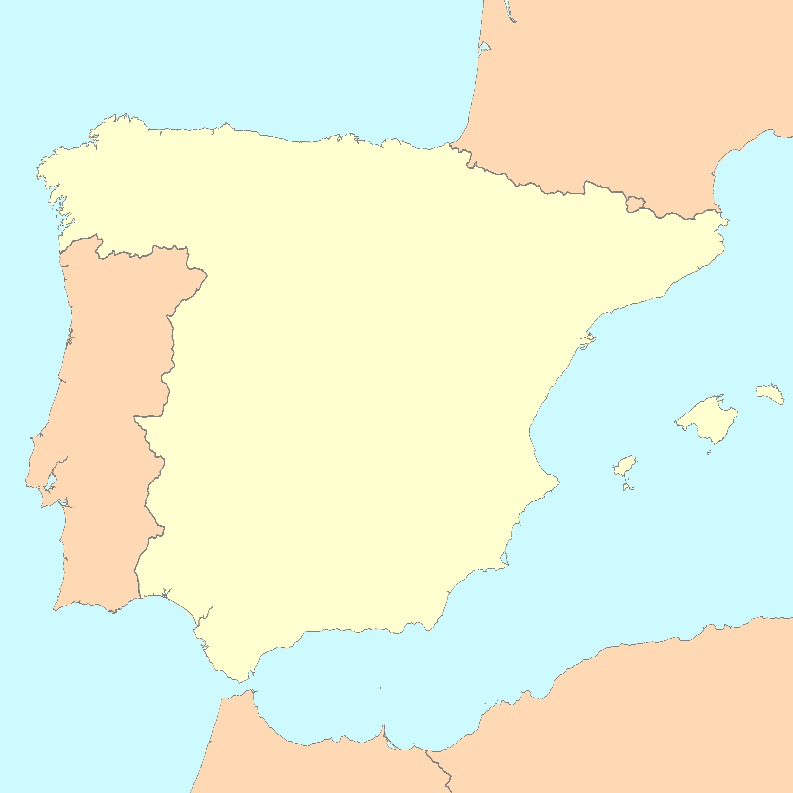

# Virgin Mobile - el nuevo servicio de fibra y móvil en España

La oferta de servicios de fibra óptica y móvil en España es amplia y variada. Pero las opciones se ampliarán próximamente con la llegada de Virgin Mobile España, una nueva ramificación del proveedor británico de telefonía (que a su vez pertenece al holding Virgin Group) que llegará a nuestro país con la intención de posicionarse como uno de los principales operadores en el mercado.

| First Header  | Second Header |
| ------------- | ------------- |
| Content Cell  | Content Cell  |
| Content Cell  | Content Cell  |

1.	¿Quién es Virgin Mobile?
2.	Virgin Mobile y España: una relación que comenzará en 2020
3.	¿Qué cobertura de fibra y móvil utilizará Virgin Mobile?
4.	¿En qué territorios estará disponible Virgin Mobile?
5.	¿Tendrá Virgin Mobile paquetes de fibra, móvil y TV?

## ¿Quién es Virgin Mobile?

Virgin Mobile fue el primer OMV (operador móvil virtual) del mundo. En 1999 se cerró el acuerdo entre One2One (posteriormente T-Mobile) y Virgin Group para la prestación de servicios de telefonía móvil del segundo, bajo el nombre de Virgin Mobile, en UK.

A partir de aquí, la marca de telecomunicaciones se expandió más allá de territorio británico; Estados Unidos, Australia o gran parte de los países latinoamericanos ya tienen disponibles las tarifas y ofertas de fibra óptica y móvil del operador fundado por la multinacional Virgin Group, propiedad de Richard Branson.

## Virgin Mobile y España: una relación que comenzará en 2020

La llegada de Virgin Mobile a España se hará realidad en la primera mitad del año 2020. El acuerdo del gigante anglosajón con la compañía Euskaltel es el desencadenante del nacimiento de una nueva opción de servicios de fibra y móvil dentro del territorio nacional. 

El fondo de capital riesgo Zegona ha sido en parte el responsable de este acuerdo. Su OPA amistosa (con una inversión de casi 200 millones de euros) duplicará sus acciones en la empresa, alcanzando casi un 30% del total. El crecimiento de Euskaltel ha sido el detonante para que Virgin Mobile haya elegido al operador vasco para acceder a nuestro país.

No es la primera vez que la empresa británica intenta introducirse en España; en el año 2015 el acercamiento con el operador Yoigo estuvo a punto de llegar a buen puerto, pero la noticia, que corrió como la pólvora entre los distintos medios de comunicación españoles, se quedó simplemente en anécdota.

-Cuadro de texto destacado-

Si todo transcurre según lo acordado Abril de 2020 será la fecha donde Virgin Mobile esté operativo y disponible en toda España. 

## ¿Qué cobertura de fibra y móvil utilizará Virgin Mobile?

Al venir de la mano de Euskaltel, con casi toda seguridad la cobertura de fibra y móvil de Virgin Mobile tenga características similares a la del grupo vasco, al igual que las de sus filiales: R en Galicia y Telecable en Asturias. 

Por un lado, la cobertura de fibra óptica mantendría en Euskadi, Galicia y Asturias los modelos de los operadores actuales (siempre que se confirme la absorción de Mundo R y Telecable), mientras que en el resto del territorio el encargado de llevar la máxima velocidad de navegación a viviendas y establecimientos será Orange, después de un acuerdo con la filial española del grupo francés.

En cuanto a la cobertura de móvil, Virgin colaborará con Orange en la totalidad del territorio español. En este campo se expande el acuerdo del que se benefician Euskaltel y R (Telecable utiliza actualmente cobertura Movistar), con el uso de sus infraestructuras, instaladas en el 100% de las regiones españolas.

## ¿En qué territorios estará disponible Virgin Mobile?

¿Estará disponible en mi ciudad o provincia? Esto se corresponde siempre a una de las mayores dudas de los usuarios con respecto a la aparición de nuevos operadores. Con Virgin Mobile la respuesta es muy sencilla: si. 

Todas las regiones de España, independientemente de su localización, podrán disfrutar de todos los servicios disponibles. Gracias a los acuerdos con Euskaltel (y sus filiales) y Orange, sea cual sea tu provincia, podrás contratar tanto fibra como móvil o TV online con Virgin Mobile, a excepción de aquellas donde prevalezca el operador regional.

## ¿Tendrá Virgin Mobile paquetes de fibra, TV y móvil?

Al igual que el resto de las operadoras se prevé que Virgin Mobile ofrezca a sus clientes una gran variedad de paquetes de fibra, TV y móvil, con el fin de que cada usuario pueda elegir lo que más se adapte a sus necesidades en cada momento.

Por ahora Virgin Mobile no ha hecho pública su política de tarifas, cosa que se espera estén disponibles una vez el servicio esté activo, en Marzo o Abril de 2020, pero no cabe duda que contará con un amplio abanico de posibilidades.

-Crear un enlace interno a otro post más específico de los posibles paquetes disponibles (aunque ahora mismo no tengamos datos exactos ni confirmados)
