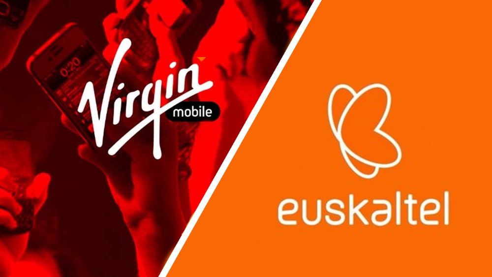

<!-- # Virgin Mobile - Euskaltel: crónica de un acuerdo anunciado -->

<!-- 

 -->

<!--  -->

<!-- 

 -->

#### Tabla de Contenidos

* ######  [Las compañías cierran el trato para ofrecer fibra y móvil en España](#espana)
* ######  [¿Cuál es el plan de expansión de Euskaltel?](#plan)
* ######  [¿Cuándo se conocerán las tarifas de Virgin en España?](#tarifas)
* ######  [Virgin: la historia de un holding capitaneado por Richard Branson](#holding)

## Las compañías cierran el trato para ofrecer fibra y móvil en España

Febrero ha sido el mes donde se ha confirmado el acuerdo entre los dos operadores de telefonía. **Virgin y Euskaltel unen sus fuerzas en España para poder promover su estrategia de expansión** dentro de las fronteras del territorio nacional. En la actualidad, la empresa con sede en Vizcaya funciona en buena parte de la zona norte de la península, bien sea bajo su nombre o el de sus filiales: R en Galicia y Telecable en Asturias. 

La alianza con la multinacional encabezada por el empresario Richard Branson permitirá a Euskaltel equiparse a aquellos competidores que lideran la cuota de mercado de fibra y móvil en España. La idea de la necesidad de una expansión nacional vino de la mano del grupo de inversión Zegona (actuales máximos accionistas de la firma vasca), los cuales tomaron la decisión de buscar un nuevo socio para irrumpir de lleno en la captación de nuevos clientes.
    

    
## ¿Cuál es el plan de expansión de Euskaltel?
   
La marca Virgin buscará llegar al 85% del mercado español que todavía no tenían la opción de **contratar las tarifas móviles y de fibra óptica del operador vasco**, según indicó el consejero delegado José Miguel García. Por otra parte, Euskaltel rubricó un acuerdo el pasado mes de Diciembre con Orange para la renovación del uso de su red de fibra y móvil hasta 2024, que permitirá a todos los usuarios residentes en España el uso de Virgin Telco en todas las zonas donde esté operativa la filial española del grupo francés.

    
## ¿Cuándo se conocerán las tarifas de Virgin en España?

El pasado 10 de Marzo fue la fecha elegida por los máximos responsables de las operadoras para hacer públicas [su nuevo plan de negocio](https://www.ofertasvirgin.es/home/plan-de-negocio-2020-2025-euskaltel) con vigencia hasta 2025. Las tarifas todavía no se han dado a conocer, pero sin duda se puede afirmar que, teniendo en cuenta las declaraciones Xabier Iturbe (presidente de Euskaltel) y José Miguel García, con ellas intentarán situarse como una alternativa de peso a las actuales ofertas disponibles propuestas por Vodafone o Movistar.

La oferta de Virgin buscará, a priori, entrar al mercado de manera ágil y con precios accesibles, diferenciándose de esta manera de la línea seguida por la operadora en los últimos tiempos. 

    
## Virgin: la historia de un holding capitaneado por Richard Branson

El grupo Virgin ha sido una de las empresas más importantes en el panorama británico desde principios de la década de los 70’. Su nombre se relaciona inmediatamente con la celebérrima discográfica o la aerolínea. Pero su radio de acción se expande mucho más allá de eso: servicios de internet de banda ancha, distribuidora de videojuegos y hasta una cadena de gimnasios. 

Y todo sin olvidarse de la gran importancia que alberga Virgin Mobile, un operador de telefonía que ya está disponible en numerosas localizaciones, tales como Estados Unidos, Australia o gran parte de Sudamérica. **En este 2020 llegará a España de la mano de Euskaltel**; una nueva aventura para seguir agrandando su leyenda en el mundo de los negocios en general y de las telecomunicaciones en particular.

    
