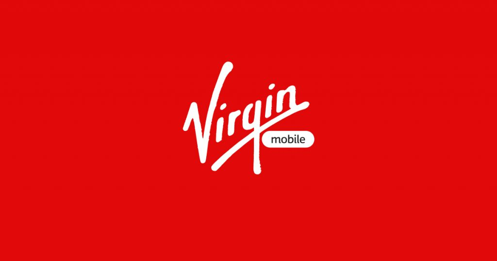

<!-- # ¿Qué es y cuánto tarda una portabilidad? -->

<!-- 

 -->
    
<!--  -->

<!-- 

 -->
### Tabla de Contenido

* ######  [¿Qué es la portabilidad?](#que)
* ######  [¿Cómo saber cuál es mi operadora?](#operadora)
* ######  [¿Puedo conservar mi número de teléfono?](#conservar)
* ######  [¿Cuánto tarda una portabilidad?](#cuanto)
* ######  [¿Cómo se hace una portabilidad?](#como)
* ######  [¿Cuál es el coste de la portabilidad entre compañias?](#companias)
* ######  [¿Qué tengo que hacer cuando la portabilidad ya esté finalizada?](#dia)

_Seguro que alguna vez has cambiado de compañía telefónica, en busca de alguna oferta móvil mejor, ¿cierto? Habrás oído hablar entonces de la portabilidad entre operadoras. Pero ¿sabes en qué consiste realmente una portabilidad?¿Cuánto tarda en hacerse la portabilidad? ¿Cómo se hace? Hoy en Virgin Telco vamos a responder a todas tus dudas sobre la Portabilidad. No te pierdas el post de hoy._

## ¿Qué es la portabilidad?
    
Portabilidad es el proceso por el cual puedes **cambiar de operadora de telefonía conservando tu mismo número** de teléfono.

Cuando buscas cambiar de tarifa móvil, para mejorar los servicios disponibles o el precio que pagas actualmente, y quieres cambiar de compañía, puedes solicitar una portabilidad de línea de tu actual operador a aquel al que deseas incorporarte.

Para hacer una portabilidad de tu línea móvil deben suceder 2 cosas: 
    
1. Darte de baja en tu actual operador.

2. Darte de alta en otra compañía telefónica.

En Virgin Telco disponemos de numerosas **ofertas de portabilidad móvil**, donde podrás escoger la tarifa móvil que mejor se adapte a tus necesidades.
    

    
    
## ¿Cómo saber cuál es mi operadora?
    
Si quieres saber cuál es tu operadora de telefonía, en la página de la [Comisión Nacional de Mercados y la Competencia](https://numeracionyoperadores.cnmc.es/portabilidad/movil) podrás comprobarlo fácilmente, solo debes de introducir tu número de teléfono.
    

    
    
## ¿Puedo conservar mi número de teléfono?
    
Sí. Los usuarios de servicios de telefonía móvil de Virgin Telco **tienen derecho a conservar su número de teléfono** cuando cambian de operador. A esto se le denomina portabilidad. Las compañías telefónicas están obligadas a ceder los números de un cliente cuando este se dé de baja como tal y, simultáneamente, se dé de alta en otro operador.

## ¿Cuánto tarda una portabilidad?
    
Da igual la tarifa que elijas, lo importante es que durante todo el proceso de cambio entre compañías telefónicas, la línea nunca se interrumpe. De esta forma puedes seguir disfrutando de línea y datos sin problema.  

Las portabilidad entre compañías suele ser un proceso rápido, **dura aproximadamente un día hábil**. Lo bueno es que, como comentamos antes, siempre dispondrás del servicio de tu línea de teléfono. El cambio de compañía suele realizarse entre las 2 y las 6 de la madrugada, de esta forma nos aseguramos de que siempre tengas línea.
    

    
    
## ¿Cómo se hace una portabilidad?  
    
Estos son los pasos que suceden durante un **proceso de portabilidad** para cambiar de operador:

1. Mantienes tu número de teléfono, tanto móvil como fijo, aunque puedes pedir un cambio de número si quieres.

2. El proceso consiste en dar de baja el servicio en tu actual compañía para darlo de alta en la nueva compañía.  

3. Si eres cliente de contrato, no hace falta que te des de baja en el operador actual, ya que es la compañía nueva quien se encargará de todos los trámites correspondientes a tu baja. 

4. Si con tu compañía actual tienes un contrato en vigor, asegúrate de haber terminado el periodo de permanencia. Si no ha finalizado, y quieres continuar con el cambio de compañía, deberás abonar el cargo por cancelación de contrato. Te recomendamos que contactes con tu compañía para informarte, antes de solicitar la portabilidad.
 
5. Para llevar a cabo la portabilidad de tu línea, debes formalizar un contrato con tu nueva operadora. Para ello la compañía necesita los siguientes datos: NIF/CIF/NIE/pasaporte, número de cuenta bancaria, la tarifa con los servicios que quieres contratar y si incluye la compra de un teléfono móvil. 
    

    
    
## ¿Cuál es el coste de la portabilidad entre compañías ? 

El proceso de cambiar de compañía telefónica no te supondrá ningún gasto, ya que es un **trámite 100% gratuito**. En Virgin Telco nos hacemos cargo de la portabilidad, para que tu no tengas que hacer ninguna gestión.
    
Es importante que antes compruebes que tu periodo de permanencia con la anterior compañía ha terminado; en caso de que no finalice deberás abonar el importe correspondiente a la finalización del contrato. 
    

 
    
## ¿Qué tengo que hacer cuando la portabilidad ya esté finalizada?
    
El cambio de compañía telefónica o portabilidad se hace en 1 día hábil aproximadamente; y el cambio de operadora se hace de madrugada de 2:00 a.m a 6:00 a.m.

Si compraste en nuestra tienda o por teléfono, introduce la SIM que Virgin Telco te ha facilitado en tu dispositivo y empieza a disfrutar de nuestros servicios. Sigue sus instrucciones para disfrutar del servicio; podrás cambiar el código Pin y mucho más. .

Una vez activada tu nueva Sim Virgin Telco ya puedes utilizar todos los servicios de tu tarifa en tu móvil sin ningún problema y disfrutar de las ventajas de ser un cliente Virgin Telco. 

Ahora que y sabes en qué consiste la portabilidad y cuánto tarda, no te olvides de elegir una de nuestras ofertas de fibra y móvil. Con Virgin Telco disfruta de ofertas exclusivas para nuevos clientes, siempre con la mejor cobertura, para que nunca te falte de nada. 
    
¿Todavía no conoces nuestras tarifas de móvil y fibra? Descubre ahora Virgin Telco.  
    
