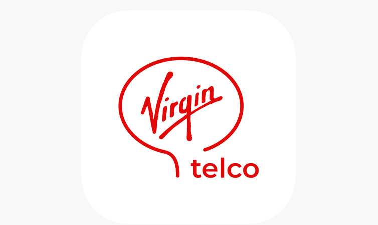

<!-- # Cobertura de Virgin telco: toda la información que necesitas -->

<!--  -->
<!-- 

 -->

### TABLA DE CONTENIDO

* ######  [¿Cuál es la red de cobertura de Virgin telco?](#red)
* ######  [¿Qué cobertura fibra y móvil utilizará Virgin telco?](#cobertura)
* ######  [¿Cuáles son las ventajas del 5G?](#5g)
* ######  [Cobertura móvil de Virgin telco: detalles y ventajas](#movil)
* ######  [¿Dónde estará disponible la fibra óptica de Virgin telco?](#fibra)
* ######  [¿Cuáles son las ventajas de la fibra óptica?](#ventajas)

## ¿Cuál es la red de cobertura de Virgin telco?

Virgin telco aterriza en España de la mano de Euskaltel. El nuevo operador será la gran novedad de este 2020 en cuanto a opciones de contratación de fibra, móvil y TV. A diferencia de la compañía vasca, su cobertura se expande más allá de Euskadi y alrededores; **Virgin será la encargada de dar cobertura de fibra y móvil a todo el territorio nacional**, excluyendo las regiones donde Euskaltel y sus filiales (R en Galicia y Telecable en Asturias) ya son las encargadas de proporcionar estos servicios.

La cobertura será una de las grandes fortalezas de la marca británica, con Orange y Movistar brindando apoyo de primera mano; el uso de sus redes de fibra óptica a lo largo y ancho del país dará oportunidad a Virgin telco de convertirse en una de las firmas punteras en el sector de las telecomunicaciones.

### ¿Qué cobertura fibra y móvil utilizará Virgin telco?

1.  **Cobertura Fibra**: Fibra NEBA de Telefónica y Fibra FFTH de Orange.
2.  **Cobertura Móvil**: Red 2G, 3G y 4G de Orange. Próximamente estará disponible el red 5G.

### ¿Cuáles son las ventajas del 5G?

La red móvil de quinta generación está dando sus últimos avances para convertirse en el gran protagonista del mundo tecnológico dentro de nuestras fronteras. En otros países como Estados Unidos o China, esta red de alta velocidad ya está disponible para los usuarios de telefonía móvil desde finales de 2019; **en España la fecha elegida como punto de partida para el uso de 5G es Junio de 2020**. La lista de ventajas con respecto a su hermano menor, el 4G, son estas:

* Mayor velocidad
* Ahorro de batería
* Cobertura incluso en zonas de difícil acceso
* Disminución de la latencia
* Aumento del ancho de banda

## Cobertura móvil de Virgin telco: detalles y ventajas

La **red de Orange** será la encargada de **proporcionar cobertura móvil de Virgin telco** por todo el territorio español. Gracias a la gran infraestructura instalada en todas las comunidades autónomas del país, Orange es capaz de ofrecer dicho servicio en el 99% de los núcleos de población; así que independientemente de si tu domicilio se encuentra en una gran urbe o en zonas rurales, no tendrás que preocuparte, podrás navegar y comunicarte sin ningún tipo de problema.

Las 4 grandes **ventajas de la cobertura móvil de Virgin** son:

* Garantiza estar siempre conectado, con su variedad de redes 4G, 3G y 2G, que se adapta a tu localización.
* La cobertura está disponible en casi el 100% del territorio.
* Máxima velocidad para navegar sin cortes.
* Máxima calidad en llamadas de voz.

## ¿Dónde estará disponible la fibra óptica de Virgin telco?

Virgin telco ofrecerá servicio de internet de alta velocidad en España gracias al uso de la fibra óptica de Orange y Telefónica pero, ¿en qué zonas estará disponible? Al igual que con la cobertura móvil, el radio de acción de Virgin será elevado, **alcanzando prácticamente la totalidad de los rincones de la península**. 

Como ya comentamos anteriormente, la cobertura fibra estará dividida en dos redes diferentes: Fibra Neba de Telefónica y Fibra FFTH de Orange, con la primera haciendo de soporte  en aquellos lugares donde  la red del operador francés no tenga alcance. Esto supondrá un auténtico baluarte para Virgin, que tendrá una gran ventaja con muchos de sus competidores.

**Será posible contratar 300 megas, 600 megas y 1 giga**, dependiendo de las necesidades de navegación de cada usuario. Cualquiera de las tres opciones garantiza una conexión a internet de máxima calidad, que proporcionarán una magnífica experiencia de usuario a todos aquellos que deseen hacerse clientes de Virgin telco.

## ¿Cuáles son las ventajas de la fibra óptica?

Desde la llegada de la fibra óptica a los hogares, **la calidad y la velocidad de navegación ha dado un paso adelante en relación al ya obsoleto ADSL**. ¿Quieres conocer todas las ventajas de la fibra? Te las contamos:

* Puedes conectar varios dispositivos al mismo tiempo sin que repercuta en la calidad
* Tienes acceso a contenidos en definición 4K sin cortes
* Disfruta del modo online de tus videojuegos favoritos sin el tan temido LAG
* Navega al doble de velocidad que con tu antigua conexión ADSL

