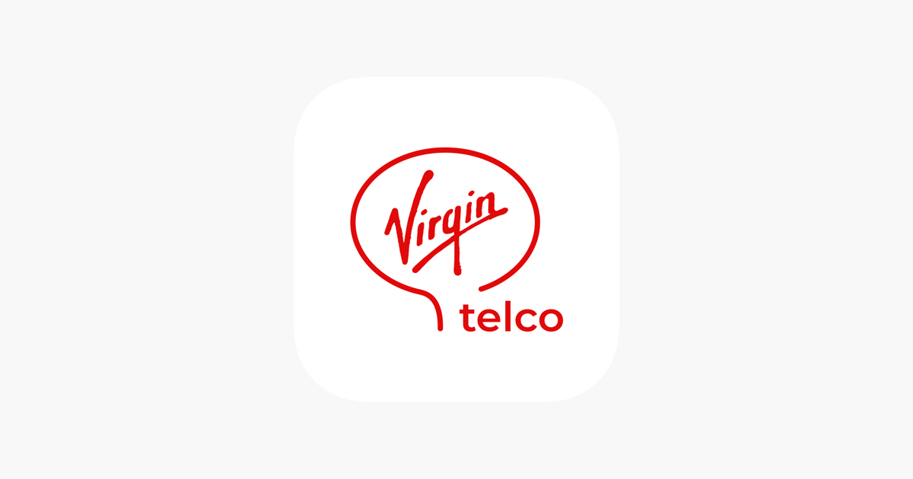

<!-- # Virgin telco apuesta por tarifas sin permanencia en sus servicios -->
<!--  -->
<!-- 

 -->

### TABLA DE CONTENIDO

* ######  [Tarifas de internet sin permanencia con Virgin telco](#tarifas)
* ######  [Tarifas fibra y móvil sin permanencia](#permanencia)
* ######  [ Mejores tarifas móviles sin permanencia](#mejores)

_Si buscas una **tarifa sin permanencia** para tu fibra o tu móvil, Virgin telco es tu operadora. En el post de hoy te contamos cuáles son nuestras mejores tarifas para que disfrutes de nuestros servicios sin ningún tipo de permanencia. Virgin telco es una operadora sin permanencia ni penalización._

_**Tarifas de internet, móvil y tv**  para que navegues a máxima velocidad, disfrutes en todo momento de la mejor cobertura y siempre con los mejores canales sin compromisos. 
En Virgin sabemos lo que es la permanencia, y no queremos que nuestros clientes se sienta atados._

## Tarifas de internet sin permanencia con Virgin telco

Muchas compañías telefónicas ofrecer condiciones muy tentadoras en sus tarifas de internet. Sin embargo, muchos usuarios no consiguen librarse del compromiso de permanencia que adquieren con la firma del contrato. 

Lo cierto es que ciertas compañías de telecomunicaciones exigen a los usuarios una permanencia de hasta 12 meses, algo abusivo. Como cliente tienes la posibilidad de romper el contrato, eso sí, deberás abonar el importe de la penalización por cancelar tu contrato con la operadora antes de lo pactado. 

Para evitarte este mal trago, la mejor opción es buscar una tarifa de internet que no tenga permanencia, evitando así pagos extra por penalizaciones. Virgin telco ofrecemos las mejores tarifas de internet sin permanencia, ideales para aquellos que no quieran complicarse. 
 
Tu mismo puedes elegir entre nuestras ofertas de fibra y adsl la que mejor se adapte a tus necesidades. Elige aumentar o disminuir tus megas con Virgin telco y olvídate de compromisos.

## Tarifas fibra y móvil sin permanencia 

Siempre es importante comparar ofertas de internet, telefonía y televisión de los distintos operadores del mercado. En Virgin telco ofrecemos las principales novedades en el mundo de las telecomunicaciones, además de **ofertas en tarifas de fibra y móvil**.
Con el fin de ofrecerte el servicio que te ayude a ahorrar en la factura de internet, sin perder calidad en el servicio.

Contratar una oferta combinada de internet y móvil y unificar todos los servicios con una misma operadora es la mejor opción para ahorrar en tu factura.
Si lo que necesitas es una tarifa de internet y móvil sin compromiso de permanencia no te pierdas nuestras fantásticas tarifas.

## Mejores tarifas móviles sin permanencia 

Para contratar las mejores tarifas móviles sin compromiso de permanencia has de tener en cuenta dos factores principales: 

* **Llamadas de voz**.- Si realizas muchas llamadas o bien dichas llamadas son de larga duración, la mejor opción es contratar una tarifa de móvil con muchos minutos gratis o incluso llamadas ilimitadas. Si por el contrario, no sueles hacer muchas llamadas o son más bien breves, lo ideal es evitar gastar dinero y elegir una tarifa con pocos minutos. 

* **Datos móviles**.- Ya sea navegar por internet, dar uso a nuestras redes sociales y utilizar nuestras apps favoritas, hoy en día es impensable no contar con una tarifa de datos móviles con nuestro smartphone. Olvídate de depender de las redes wifi, contrata una tarifa móvil con suficientes datos para sacar el mayor partido a tu móvil. 

Si buscas contratar algún servicio de Internet, móvil o televisión sin permanencia; en Virgin telco disponemos de las ofertas del mercado sin compromiso. Para que consigas el mejor servicio siempre al mejor precio y sin ataduras.

Descubre ahora nuestras ofertas, **descubre Virgin telco**. 

