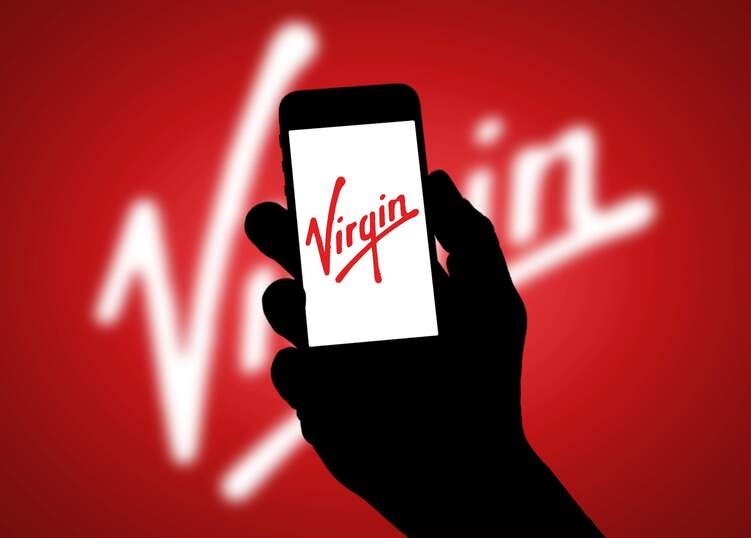

# Personaliza tu propia tarifa con Virgin telco

* ######  [¿Qué tarifas de fibra tendrá disponibles Virgin telco?](#fibra)
* ######  [¿Qué tarifas de móvil tendrá disponibles Virgin telco?](#movil)
* ######  [¿Qué canales de TV se podrán ver en Virgin Telco?](#tv)

_La nueva oferta de fibra, móvil, fijo y TV de Virgin telco tiene un factor que la diferencia de cualquier otra existente en el mercado: con ella **puedes contratar únicamente los servicios que necesites**. Esto evita la necesidad de elegir un pack predefinido por la compañía, lo que provoca en muchas ocasiones un incremento de la factura del cliente al no poder diseñar de manera individual y libre una tarifa a tu medida._

_Vamos a hacer un repaso de todos los **servicios que estarán disponibles en Virgin telco a partir del próximo mes de Junio**. Te servirá de ayuda para empezar a planificar tu nueva tarifa personalizada._

## ¿Qué tarifas de fibra tendrá disponibles Virgin telco?

En primer lugar, tendrás que elegir la velocidad de fibra que necesitas para tu domicilio. En caso de no tener disponible fibra óptica en tu localidad, existe la posibilidad de contratar internet mediante ADSL; con esto se garantiza que el 99% del territorio nacional podrá darse de alta para empezar a navegar de manera inmediata. Las oferta de internet se dividirá en 3 alternativas:

* **300 megas**
* **600 megas**
* **1 giga**

Si quieres añadir el teléfono fijo en tu plan personalizado, Virgin te dará la oportunidad de escoger entre dos packs:

* **Pack 1**: Llamadas a fijo y móvil ilimitadas
* **Pack 2**: Llamadas ilimitadas a fijo + 100 minutos a móvil

## ¿Qué tarifas de movil tendrá disponibles Virgin telco?

Al igual que en el apartado de internet, cada nuevo cliente de Virgin telco podrá adaptar su tarifa móvil a sus requisitos personales. Cada usuario tiene diversos factores claves a la hora de estimar el número de gigas necesarios durante el transcurso de su día a día; dependiendo de tu frecuencia de uso podrás elegir la cantidad de datos contratados, para que solo pagues por aquellos que requieras.

* **Uso esporádico**: 2 gigas
* **Uso normal**: 10 gigas
* **Uso masivo:** 20 gigas

Para acabar de personalizar tu tarifa, existen una serie de **servicios adicionales** (más megas de navegación, multisim, bono internacional, etc) que completarán tu oferta.

## ¿Qué canales de TV se podrán ver en Virgin Telco?

La televisión a la carta se ha convertido en uno de los grandes alicientes a la hora de inclinarse por uno u otro operador telefónico. Cada vez la oferta es más amplia, por lo que los usuarios demandan el mayor contenido posible al mejor precio. En Virgin telco se ofertan** 80 canales agrupados en temáticas**, para que todos los usuarios encuentren sus series, películas o documentales favoritos. En cada domicilio se instalará decodificador** 4K Android TV**, con el que podrás disfrutar cada día de tus contenidos preferidos en alta definición.

* **Pack Premium:** 80 canales temáticos. Cine y series (TCM, TNT, Calle 13…), infantiles (Boing, Clan…), deportes (Gol, Real Madrid Televisión…) o noticias internacionales (CNN, BBC…) están incluidos en este paquete.
* **Pack Premium Extra:** Hay que añadir 30 canales a los incluidos en el pack premium, entre los que destacan Movistar Series, Fox, AXN, National Geographic, Disney Junior o Eurosport.  
* **Plataformas descargables:** Con el deco 4K se pueden descargar las apps de Netflix, Disney+, Filmin, Prime Video o DAZN; la mejor oferta televisiva disponible en la actualidad, a tu alcance.

