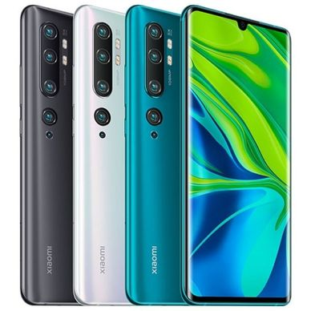
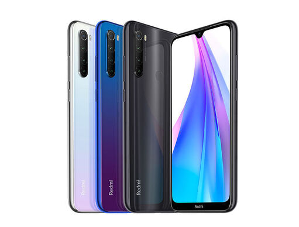
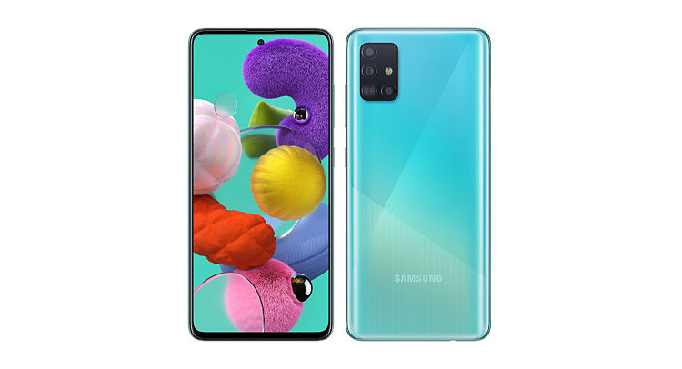
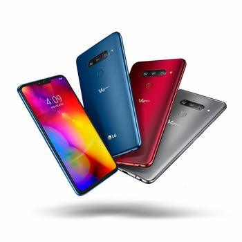
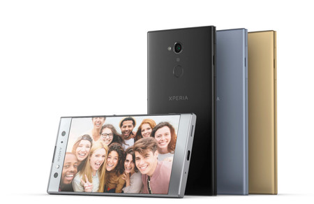
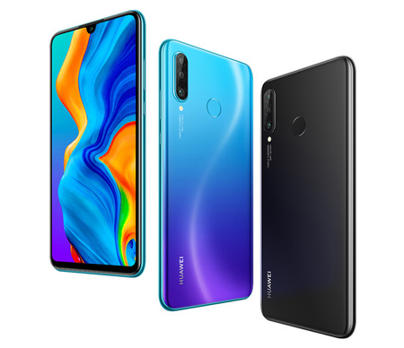

<!-- # ¿Cuál es el mejor móvil calidad precio del 2020? -->

<!-- 

 -->

## ÍNDICE DE CONTENIDOS
## 

* ######  [Nos basamos en los datos](#datos)
* ######  [¿Qué características se buscan en un smartphone?](#caracteristicas)
* ######  [Top 6 mejores smartphones relación calidad precio den 2020](#smartphones)
* ######  [Xiaomi Mi Note 10](#xiaomi)
* ######  [Xiaomi Redmi Note 8T](#redmi)
* ######  [Samsung Galaxy A51](#samsung)
* ######  [LG V40 ThinQ](#lg)
* ######  [Sony Xperia XA2 DS](#sony)
* ######  [Huawei P30 lite](#huawei)

_¿Estás pensando en cambiar de smartphone? Estas de suerte, hoy en el Blog de Virgin telco te traemos el Ranking de mejores móviles relación calidad precio del 2020._

Como bien sabrás, los smartphones nos ayudan de mil formas diferentes en nuestro día a día. Es más, muchos ya no conciben salir de casa sin su móvil. Lo cierto es que nos ayudan a lidiar con diferentes ámbitos de nuestra vida, ya sea en el trabajo o durante un viaje. Los móviles forman parte de nosotros. 

En este post te contamos cuáles son los principales aspectos en los que debes fijarte cuando buscas comprar un móvil nuevo. También te contamos cuáles son los mejores móviles en relación calidad precio hasta la fecha. ¡No te lo pierdas!

## Nos basamos en los datos

Según el Estudio Anual de Mobile en España elaborado por GFK y People nos vuelcan los datos de la presencia que Internet tiene en la vida de los españoles.

La realidad es que Internet ha tenido la capacidad de penetrar en el día a día del 82% de los españoles, de los cuales, el 96% tienen un smartphone. 

Según informa el [INE](https://www.lne.es/vida-y-estilo/tecnologia/2018/01/21/tardamos-espanoles-cambiar-movil/2226265.html), la vida media de los móviles de los españoles es de 30 meses, aproximadamente 2 años y medio, antes de que lo cambien por un móvil nuevo. También afirman que el 92% de los españoles se decantan por la compra de smartphones, información relacionada con el fuerte impacto de Internet en nuestra sociedad. 

## ¿Qué características se buscan en un smartphone?

### La cámara

Tanto la cámara frontal como trasera, debe tener buena resolución para poder sacar fotos y vídeos de calidad. La fotografía es una de las áreas diferenciales entre las diferentes gamas de los teléfonos móviles, fundamental a la hora de elegir un móvil de calidad a buen precio.  

### La pantalla 

Está claro que la tendencia está enfocada a pantallas más grandes y marcos prácticamente inexistentes. ¿Dónde está el punto de partida? En las 6 pulgadas. Esto dificulta cada vez más el uso de móvil con una sola mano. 
No debemos olvidar la importancia de una buena resolución en brillo y contraste, que nuestro teléfono no nos la juegue con la luz exterior.

### Memoria RAM

Estamos acostumbrados a utilizar varias aplicaciones al mismo tiempo, por lo que necesitamos un móvil con suficiente memoria RAM para que no colapse.  Cuanta más RAM, más apps podremos ejecutar al mismo tiempo, y también conseguiremos saltar entre una aplicación y otra más rápidamente.

### Apariencia

Es cierto que la apariencia de un móvil va en función de los gustos de cada uno. Sin embargo, la nueva tendencia son smartphones compactos, sin bordes y con líneas minimalistas. 

### La duración de la batería

Buscamos teléfonos cuya batería dure lo suficiente para poder darle uso el máximo número de horas sin tener que depender de un enchufe o una batería externa. 

### Memoria interna

Fotos, vídeos, archivos… admítelo, una buena memoria nos soluciona la vida. 

## Top 6 mejores smartphones relación calidad precio den 2020

###  Xiaomi Mi Note 10

**Características**: 
* Precio - Desde 450€
* Almacenamiento - capacidad de almacenamiento de 128GB.
* Memoria RAM - 6GB de RAM.  
* Pantalla - pantalla AMOLED de 6,47 pulgadas con lector de huella.
* Cámara - 5 cámaras capitaneadas por una de 108 megapíxeles.
* Sistema operativo - Android.
* Batería - batería de 5260 mAh y carga rápida de 30W.

**Ventajas**

* Calidad fotográfica.
* Pantalla de gran calidad y curvada en los laterales. 
* Batería de larga duración. 

**Inconvenientes**
* Audio con un solo altavoz 
* No es resistente al agua
* Precio elevado. 

###  Xiaomi Redmi Note 8T

**Características**: 
* Precio - Desde 159€
* Almacenamiento - variantes de 32GB, 64GB o 128 GB.
* Memoria RAM - variantes 3GB, 4GB de RAM.
* Pantalla - pantalla de 6,3 pulgadas.
* Cámara - 4 cámaras de 48 megapíxeles
* Sistema operativo - Android 9 Pie con MIUI 10.
* Batería - batería de 4.000mAh con carga rápida. 

**Ventajas**
* Precio económico. 
* Cámara de calidad. 
* Batería con carga rápida. 
* Reconocimiento de huella dactilar en la parte trasera. 

**Inconvenientes**
* Materiales no son de primera calidad. 
* No tiene pantalla OLED.

###  Samsung Galaxy A51

**Características** 
* Precio - Desde 270€
* Almacenamiento - 128 GB con ranura MicroSD que permitirá ampliar su capacidad hasta 512 GB.
* Memoria RAM - 4GB, 6GB
* Pantalla - pantalla de 6.4 pulgadas Full HD Super AMOLED
* Cámara trasera - tres cámaras traseras de: 25 Mp AF (F1.7), 8 Mp FF (F2.2) y enfoque dinámico 5MP FF (F 2,2).
* Cámara frontal - cámara frontal es 20 Mp FF f/2.0.
* Sistema operativo - Android 10.
* Batería - carga rápida de 4000 mah.

**Ventajas**
* Buen rendimiento.
* Reconocimiento de huella dactilar. 
* Pantalla grande y de muy buena calidad. 

**inconvenientes**
* No soporta redes 5G.
* No es resistente al agua.
* Tapa trasera de plástico.

###  LG V40 ThinQ

**Características**: 
* Precio - Desde 360€.
* Almacenamiento - 64 GB o 128 GB
* Memoria RAM - 6 GB
* Pantalla - 6,4 pulgadas QHD+ OLED FullVision
* Cámara trasera - Cámara triple: Óptica estándar: 12 Mpíxeles, Gran angular: 16 Mpíxeles , Teleobjetivo: 12 Mpíxeles.
* Cámara frontal - Óptica estándar: 8 Mpíxeles, Angular: 5 Mpíxeles.
* Sistema operativo - Android 8.1 Oreo
* Batería - 3300 mAh.

**Ventajas**
* Tiene una cámara de gran calidad.
* Gran memoria RAM.

**Inconvenientes**
* Precio elevado.

###  Sony Xperia XA2 DS

**Características**: 
* Precio - Desde 265€
* Almacenamiento - 32GB.
* Memoria RAM - 3GB con ranura microSD.
* Pantalla - Full HD de 5.2 pulgadas con cristal Gorilla Glass, mayor resistencia a los golpes.
* Cámara - 23 Mpíxeles.
* Sistema operativo - Android 8.0
* Batería - 3300 mAh.

**Ventajas**
* Pantalla reforzada.
* Mejor relación calidad precio.

**Inconvenientes**
* Poca memoria RAM. 

###  Huawei P30 lite

**Características**: 
* Precio - Desde 349€.
* Almacenamiento - 128 GB con ranura microSD
* Memoria RAM - 4GB.
* Pantalla - 6,15 pulgadas IPS/LCD FullHD
* Cámara trasera - Cámara triple de 48MP (f/1.8), 8MP (f/2.4, gran angular) y 2MP (sensor profundidad, f/1.8).
* Cámara frontal - 24 MP, f/2.0
* Sistema operativo - Android 9 Pie con EMUI 9.0.1
* Batería - 3.340 mAh + carga rápida 18W.

**Ventajas**
* Buena cámara frontal.
* Móvil ligero y con bonitas líneas de diseño. 
* Reconocimiento facial. 

**Inconvenientes**
* Mala calidad de sonido. 
* Carga rápida de mala calidad.

Ahora que ya has visto cuál es el **ranking de mejores 6 móviles hasta la fecha**, seguramente te interese conocer nuestras nuevas [tarifas móviles de Virgin telco](https://ofertasvirgin.es). Lo mejor de nuestras ofertas en telefonía es que no creemos en la permanencia, por lo que dispones de total libertad. 
También dispones de la opción de contratar lo que tu realmente quieres, partes desde la opción de fibra y suma los servicios con las condiciones que más te beneficien. 
¿Todavía no conoces Virgin telco? 

