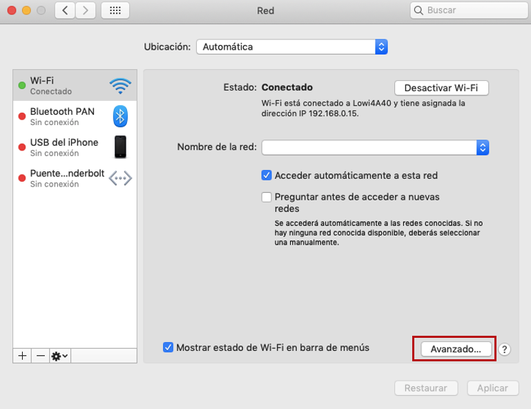

<!-- # ¿Cómo saber la dirección IP de mi router? -->

<!-- 

 -->

#### TABLA DE CONTENIDOS

* ######  [¿Qué es una dirección IP?](#ip)
* ######  [IP públicas](#publicas)
* ######  [IP privadas](#privadas)
* ######  [4 formas de saber la IP de mi router](#router)
* ######  [¿Cómo encontrar la IP de mi router en Windows?](#windows)
* ######  [Cómo encontrar la IP de mi router en Mac?](#mac)
* ######  [¿Cómo saber la IP de mi router en Android?](#android)
* ######  [¿Cómo saber la IP de mi router en IOS?](#ios)

Mucha gente se pregunta cómo saber la dirección IP del router. Aquí te explicamos cómo descubrirla en pocos pasos, tanto desde tu ordenador (Windows, Mac) como desde tu móvil (Android e IOS).

> _También te explicaremos que es una IP pública y una IP privada. Conocer la IP de tu router te servirá para acceder a su configuración o si deseas configurar una red local._ 

¡No te lo pierdas! 

## ¿Qué es una dirección IP?

IP son las siglas de “Internet Protocol”, lo que  significa “Protocolo de Internet” en español. La función de este protocolo es establecer las comunicaciones en la mayoría de nuestras redes. ¿Cómo lo hace? Asigna una dirección única para cada dispositivo que trata de conectarse a Internet.

La dirección IP está formada por una serie de cuatro bloques compuestos por números, se trata de la “matrícula” de cada dispositivo tecnológico. Las IPs se dividen en dos grupos: públicas y privadas. 

### IP públicas

Una IP pública es la identificación que te asigna tu proveedor de internet para ser reconocido en Internet.

### IP privadas

Una dirección IP privada es exactamente lo mismo que las direcciones IP públicas, solo que estas se caracterizan por ser fijas para cada dispositivo y no son accesibles desde Internet.

## 4 formas de saber la IP de mi router

Si lo que buscas es cómo detectar la IP de tu router, a continuación te explicamos 4 formas de saberlo dependiendo del sistema operativo que utilices. ¡Adelante!

### ¿Cómo encontrar la IP de mi router en Windows?

1. Indica en el buscador o en ‘Cortana‘: “símbolo del sistema”. Haz clic en el resultado y se abrirá una caja.
2. Escribe: ipconfig y pulsa ENTER.
3. Observa el resultado y busca la línea que pone dirección IPv4 y dirección IPv6.

### ¿Cómo encontrar la IP de mi router en Mac?

1. Accede a Preferencias del Sistema de tu ordenador. 
2. Entra en símbolo de Red y después entra en Avanzado. 
3. Debajo de TCP/IP, la dirección IP de su router está indicada al lado de "Router".

### ¿Cómo saber la IP de mi router en Android?

Para saber la IP del router desde un **dispositivo Android**, sigue los siguientes pasos: 

1. Entrar en los ajustes del sistema operativo, a través de la aplicación llamada Ajustes.
2. Pulsa sobre la opción de Redes e Internet. 
3. Pulsa sobre la opción Wi-Fi.

Pulsa en el icono de la rueda dentada de WiFi a la que estás conectado para acceder a su configuración y toda su información.
Es importante que estés conectado a una red WiFi,  ya que vas a obtener la dirección IP del router que está emitiendo la señal WiFi.

### ¿Cómo saber la IP de mi router en IOS?

Para conocer la dirección IP desde un **dispositivo IOS** sigue las siguientes indicaciones: 

1. Accede a los ajustes del sistema operativo de tu dispositivo, a través de la aplicación llamada Ajustes. 
2. Pulsa en la opción de Wi-Fi que te aparecerá con el nombre de la red a la que estés conectado.
3. Finalmente accede a la Wi-Fi que estés conectado con el botón de información “i”.

Ahora ya sabes cómo conocer la dirección IP de tu router. Como ves es muy sencillo y lo consigues en pocos pasos. 

No te pierdas las mejores ofertas de fibra para tu casa o trabajo. Disfruta de las mejores condiciones en tu tarifa de internet y sin compromiso de permanencia. ¿Te apuntas?
